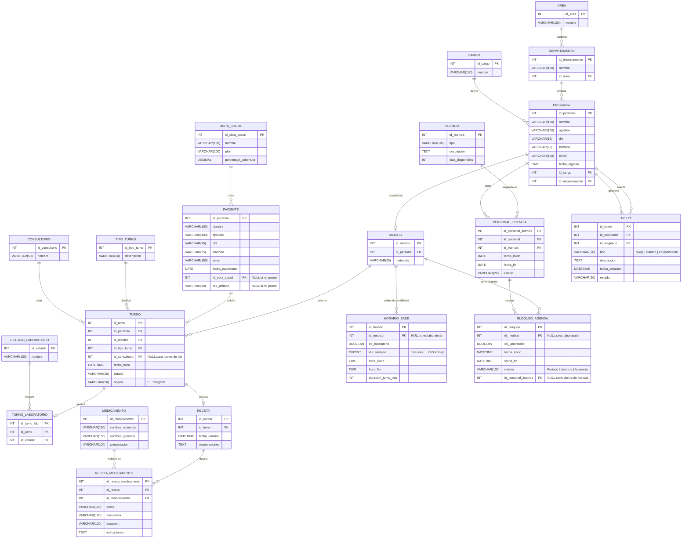

# Clínica del Sur - Diagrama Físico de Datos

## Diagrama

---

## Descripción de Tablas

### `AREA`
Representa las dos grandes áreas de la clínica: *Administración* y *Atención de Salud*.

### `DEPARTAMENTO`
Cada área contiene departamentos. Pertenece a un `AREA`.

### `CARGO`
Catálogo de los cargos disponibles en la clínica (Médico Clínico, Enfermero Jefe, Gestor de Turnos, etc.).

### `PERSONAL`
Almacena a todos los empleados de la clínica. Referencia su cargo (`CARGO`) y su departamento (`DEPARTAMENTO`).

### `MEDICO`
Extensión de `PERSONAL` exclusiva para médicos clínicos. Contiene la matrícula profesional. Solo el personal con cargo médico tendrá registro en esta tabla.

### `CONSULTORIO`
Los consultorios físicos disponibles para la atención clínica (Consultorio 1 y Consultorio 2).

### `OBRA_SOCIAL`
Catálogo de obras sociales aceptadas por la clínica. Incluye el nombre, el plan y el porcentaje de cobertura, lo que permite calcular el costo final del turno según si el paciente posee cobertura o no.

### `PACIENTE`
Personas que solicitan o tienen turnos agendados en la clínica. El campo `id_obra_social` es nullable: si el paciente no posee obra social ambos campos quedan en NULL y el turno se factura a precio de lista completo.

### `TIPO_TURNO`
Catálogo de tipos de turno: *Clínica Médica* o *Laboratorio*.

### `TURNO`
Registro centralizado de todos los turnos agendados. El campo `id_consultorio` es NULL cuando el turno es de Laboratorio. El campo `origen` indica el canal por el que fue agendado (ej: Telegram). Los turnos de Laboratorio solo pueden ser expedidos por un médico de la clínica, por lo que `id_medico` siempre es obligatorio.

### `ESTUDIO_LABORATORIO`
Catálogo de los estudios que realiza el laboratorio: Hemograma, Uroanálisis, Coproanálisis y Perfil Lipídico.

### `TURNO_LABORATORIO`
Relaciona un turno de tipo Laboratorio con el/los estudio(s) solicitado(s).

### `LICENCIA`
Catálogo de tipos de licencias disponibles para el personal (días off, licencia por enfermedad, etc.), gestionado por el Departamento de Beneficios.

### `PERSONAL_LICENCIA`
Registro de licencias asignadas a cada empleado, con sus fechas y estado.

### `TICKET`
Tickets de gestión interna creados por el personal y administrados por el Departamento de RRHH. Puede referirse a una queja, solicitud de insumos o de equipamiento. Contiene dos FK a `PERSONAL`: el solicitante y el empleado de RRHH asignado.

### `MEDICAMENTO`
Catálogo de medicamentos prescribibles. Almacena nombre comercial, nombre genérico y presentación (comprimidos, jarabe, inyectable, etc.).

### `RECETA`
Receta médica emitida durante un turno formal. Al vincularse al `TURNO` queda trazabilidad completa del médico que la emitió y el paciente que la recibió. Un turno puede generar como máximo una receta.

### `RECETA_MEDICAMENTO`
Detalle de los medicamentos incluidos en una receta. Cada fila representa un medicamento prescripto con su dosis, frecuencia, duración del tratamiento e indicaciones adicionales.

### `HORARIO_BASE`
Define el esquema semanal recurrente de disponibilidad de cada médico o del laboratorio. Indica qué días de la semana trabaja, en qué franja horaria y cuánto dura cada slot de turno. Con esta información el sistema calcula dinámicamente los slots disponibles para cualquier fecha futura sin necesidad de pre-generarlos.

### `BLOQUEO_AGENDA`
Registra excepciones al horario base: feriados, vacaciones, ausencias puntuales, etc. Si el bloqueo deriva de una licencia formal registrada en `PERSONAL_LICENCIA`, se vincula mediante `id_personal_licencia` para mantener consistencia. Al agendar un turno, el sistema cruza el `HORARIO_BASE`, los `BLOQUEO_AGENDA` vigentes y los `TURNO` ya reservados para determinar si el slot solicitado está disponible.
